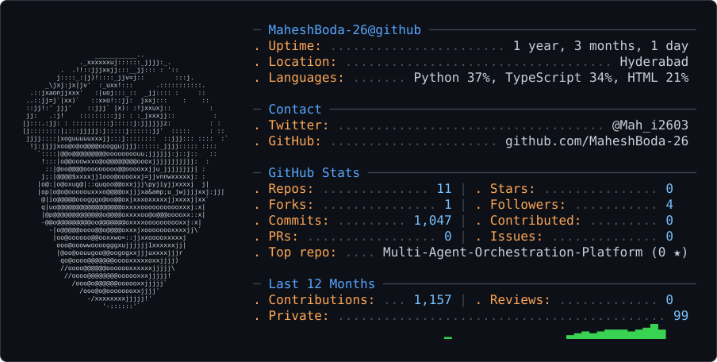

<picture>
  <source media="(prefers-color-scheme: dark)" srcset="dark_mode.svg" />
  <source media="(prefers-color-scheme: light)" srcset="light_mode.svg" />
  
</picture>

# 👋 Hi there, I'm Mahesh Boda !

  
  
  **AI Thinker.**
  
  
  

---

## 🚀 About Me

- **Bio:** AI Thinker.
- **Location:** Hyderabad
- **Repositories:** 11 public repos
- **Followers:** 4 followers

---

## 📊 GitHub Statistics

### 📈 Quick Stats
- **Total Stars Earned:** 0 ⭐
- **Total Forks:** 1 🍴
- **Open Issues:** 0 📋

---

## 🛠️ Technology Stack

---

## 📌 Pinned Repositories

### [MaheshBoda-26](https://github.com/MaheshBoda-26/MaheshBoda-26)
No description available
- ⭐ 0 stars | 🍴 0 forks
- 🛠️ **Language:** Unknown

### [Multi-Agent-Orchestration-Platform](https://github.com/MaheshBoda-26/Multi-Agent-Orchestration-Platform)
No description available
- ⭐ 0 stars | 🍴 0 forks
- 🛠️ **Language:** Python

### [Research-agent-V2](https://github.com/MaheshBoda-26/Research-agent-V2)
No description available
- ⭐ 0 stars | 🍴 0 forks
- 🛠️ **Language:** Python

---

## 🤝 Connect With Me

---

  
**⭐ Don't forget to star this repository if you found it useful!** ⭐

*Generated with [GitHub Profile Forge](https://github.com/rahuljaim/github-readme-profile-generator-forge)*

**Visitor Count:** 

